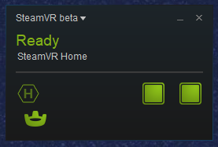
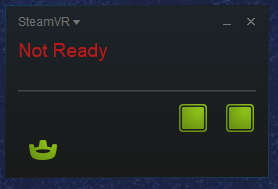

*To use the Vive Tracker without a headset:*
<ol>
	<li>Using the tracker alone is a beta feature of SteamVR. In Steam, right-click SteamVR in your library and enable Beta mode.</li>
	<li>Disconnect the headset and link box, turn off the controllers, and connect the tracker dongle.</li>
	<li>Restart SteamVR and pair the tracker to the dongle.</li>
	<li>Once you're sure the tracker is paired to its own dongle, reconnect the link box (it controls the Lighthouses).
	<li>In your file manager, go to the global SteamVR settings file: 
	<i>C:\Program Files (x86)\Steam\steamapps\common\SteamVR\resources\settings\default.vrsettings</i></li>
	<li>
		Back up the global default.vrsettings, then open it in a text editor and set the following:
		<pre>
"requireHmd" : false,
"forcedDriver" : "null",
"activateMultipleDrivers" : true,</pre>
	</li>
	<li>
	<li>Then, in your file manager, go to the null driver settings file: 
	<i>C:\Program Files (x86)\Steam\steamapps\common\SteamVR\drivers\null\resources\settings\default.vrsettings</i></li>
	<li>
		Back up the null driver default.vrsettings, then open it in a text editor and set the following:
		<pre>
"enable" : true,</pre>
	</li>
	<li><b>Note: when you want to restore normal operation of your Vive rig, change the following in global settings:</b>
		<pre>
"forcedDriver" : "",</pre>
	<li>Restart SteamVR.</li>
	<li>If SteamVR complains about Room Setup, go to: 
	<i>C:\Program Files (x86)\Steam\config\chaperone_info.vrchap</i></li>
	<li>Make any harmless change to the file (like adding a trailing space), then save it.</li>
	<li>If everything's correct, the SteamVR panel should no longer say "Not Ready" when the tracker alone is connected.</li>
	<li>You should now be able to start SteamVR and use the tracker.</li>
</ol>

Good ending: 
 
Bad ending: 
 

More info: 
https://www.roadtovr.com/how-to-use-the-htc-vive-tracker-without-a-vive-headset 
http://www.pencilsquaregames.com/getting-steamvr-tracking-data-in-unity-without-a-hmd 
https://www.reddit.com/r/Vive/comments/6uo053/how_to_use_steamvr_tracked_devices_without_a_hmd 
https://steamcommunity.com/app/358720/discussions/0/485624149150957321/#c1290690926862315884 
https://developer.valvesoftware.com/wiki/SteamVR/steamvr.vrsettings 
https://steamcommunity.com/app/358720/discussions/0/485624149150957321 
https://www.vive.com/eu/support/vive/category_howto/optin-to-steamvr-beta.html 
https://www.reddit.com/r/Vive/comments/4ly634/room_setup_files_location_steamvr 